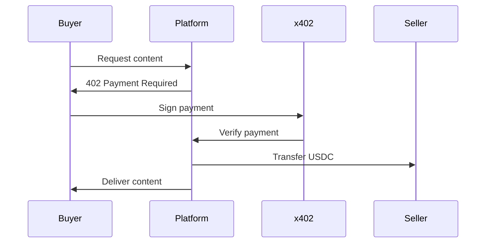

# Introduction to x402 Platform

## Overview

The x402 Platform is a modern payment solution that enables instant, programmatic USDC payments on the Base network. Built on Coinbase's x402 protocol, it provides two powerful products:

- **x402.link** - Create paywalls for any content
- **x402.me** - Personal payment profiles

## Why x402?

### For Sellers
- **Zero Fees**: Keep 100% of your payments
- **Instant Settlement**: No waiting for payouts
- **No Signups**: Wallet-based authentication
- **Global Reach**: Accept payments from anywhere

### For Buyers
- **One-Click Payments**: No accounts needed
- **Any Wallet**: 300+ wallets supported
- **Transparent Pricing**: See costs upfront
- **AI Compatible**: Agents can pay automatically

## Key Features

### 🔐 Secure
- Built on Ethereum's security via Base L2
- Non-custodial (you control your funds)
- Cryptographic payment verification
- No middleman access to funds

### ⚡ Fast
- Instant payment confirmation
- Sub-second transaction finality
- No payment processing delays
- Real-time settlement

### 💰 Cost-Effective
- Zero platform fees
- Low network fees on Base
- No monthly subscriptions
- No hidden costs

### 🌍 Universal
- Works with any EVM wallet
- Supports AI agents
- Cross-platform compatible
- No geographic restrictions

## How It Works

### Payment Flow

### Technical Architecture

The platform consists of:

1. **Frontend** - Next.js application with React
2. **Middleware** - x402 payment verification
3. **Smart Contracts** - EIP-3009 USDC transfers
4. **Database** - Convex for metadata (optional)

## Use Cases

### Content Creators
- Sell digital downloads
- Paywall premium content
- Offer exclusive access
- Monetize tutorials

### Freelancers
- Accept client payments
- Invoice with QR codes
- Instant international payments
- No payment processing fees

### Businesses
- API monetization
- SaaS subscriptions
- Micropayments
- B2B transactions

### AI Agents
- Autonomous payments
- Service consumption
- Resource access
- Programmatic commerce

## Getting Started

Ready to start accepting crypto payments?

1. **[Quick Start Guide](./quick-start.md)** - Get running in 5 minutes
2. **[Installation](./installation.md)** - Detailed setup
3. **[Configuration](./configuration.md)** - Customize settings

## Platform Comparison

| Feature | x402 Platform | Stripe | PayPal | Crypto.com |
|---------|--------------|---------|---------|------------|
| Platform Fees | 0% | 2.9% + 30¢ | 2.9% + 30¢ | 2.99% |
| Settlement Time | Instant | 2-7 days | 1-3 days | Instant |
| Account Required | No | Yes | Yes | Yes |
| AI Compatible | Yes | Limited | No | No |
| Wallet Support | 300+ | N/A | N/A | Limited |
| Chargeback Risk | None | High | High | None |

## Technology Stack

- **Blockchain**: Base (Ethereum L2)
- **Token**: USDC (USD Coin)
- **Protocol**: x402 (HTTP 402)
- **Framework**: Next.js 15
- **Language**: TypeScript
- **Styling**: Tailwind CSS
- **Wallets**: RainbowKit

## Next Steps

- [How It Works](./concepts/how-it-works.md) - Deep dive into the payment flow
- [Quick Start](./quick-start.md) - Start accepting payments
- [API Reference](./api/rest-api.md) - Technical documentation

## Support

Need help? We're here:

- 📖 [Documentation](./README.md)
- 💬 [Discord Community](https://discord.gg/cdp)
- 🐛 [GitHub Issues](https://github.com/sculptdotfun/x402-platform/issues)
- 📧 Email: support@x402.link